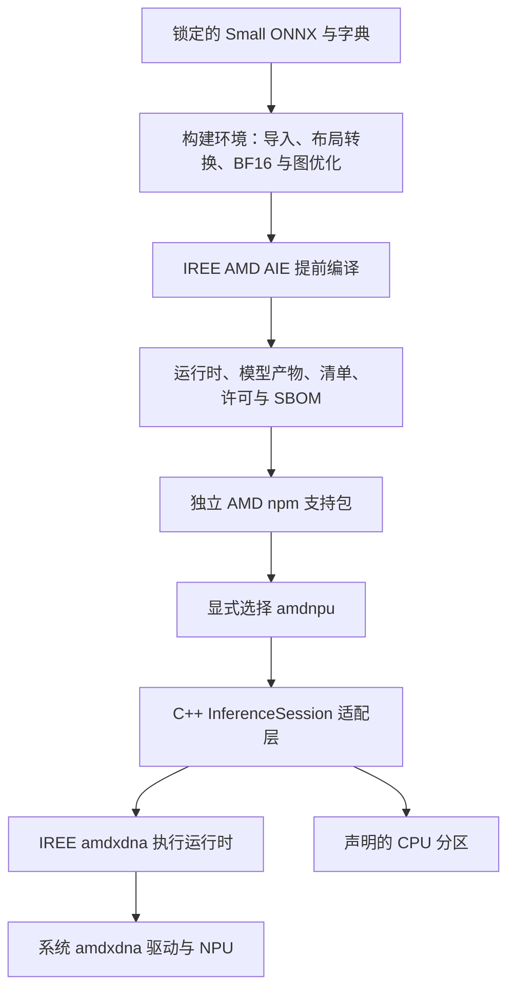

# AMD NPU 轻量部署改造方案

日期：2026-10-07。状态：完整 CPU/NPU 分区后端、20 桶、共享权重及独立支持包流程已实现；不做推理验证。

## 1. 目标与结论

将 AMD NPU 独立支持包从当前约 548 MB 下载、1.39 GB 解包的规模，改造为只包含执行运行时、OCR 编译产物和必要许可文件的部署包。LLVM、Peano、模型导入及编译工具留在构建环境。

**首选路线：评估 IREE AMD AIE 提前编译 Small 识别模型，使用对应的 IREE amdxdna 运行时。** 如编译缺口过大，第二路线采用 HRX + IRON 实现 OCR 专用内核与调度。xdna-engine 用作算法和内核参考；不整体接入 FastFlowLM。

本方案先完成编译可行性评估，再实现完整 CPU/NPU 分区后端。下文保留路线调查与阶段规划；最终实现和部署产物见文末状态及结果清单。

## 2. 范围与约束

- 首期：Linux x64 glibc、XDNA2、PP-OCRv6 Small 识别模型；检测继续使用 CPU。
- 模型基线：Small 0.3.4，识别模型 SHA256 为 `5435fd747c9e0efe15a96d0b378d5bd157e9492ed8fd80edf08f30d02fa24634`。
- 优先使用 BF16 计算，保持 FP32 输入输出及原有 CTC 字典、解码行为。首期不引入 INT8 校准路线。
- 保留 20 个识别宽度：320、384、480、544、576、608、704、736、832、960、1056、1184、1248、1376、1600、1984、2240、2560、2880、3200。
- AMD 默认关闭，继续通过 `execution.provider: "amdnpu"` 显式启用，支持包由用户单独安装；Auto 不选择 AMD。
- 维护者已取消真机验收作为发布前置条件。设备兼容性、数值结果与性能的未验证状态必须如实记录。
- Windows、musl、PHX/HPT、其他模型规模及检测模型的 NPU 改造不纳入首期。

新运行时的支持范围须重新确认。现有 vendor 后端的 STX/KRK 范围不能直接继承为新后端的设备验证结论。

## 3. 调研依据

### 3.1 固定源码与发布包

以下为本次调查使用的固定版本，而非随 `main` 更新的构建输入。

| 项目 | 源码提交或发布版本 | 用途 |
|---|---|---|
| [IREE AMD AIE](https://github.com/nod-ai/iree-amd-aie/tree/fddfec1be6ceefbdb890079d957947dfa1fe0848) | `fddfec1be6ceefbdb890079d957947dfa1fe0848` | 首选图编译器与配套运行时 |
| [IRON / MLIR-AIE](https://github.com/Xilinx/mlir-aie/tree/a75319190bdb1ca83703433b2aa8f8f52bc80565) | `a75319190bdb1ca83703433b2aa8f8f52bc80565` | 定制内核、数据流及 HRX 接入参考 |
| [xdna-engine](https://github.com/atassis/xdna-engine/tree/013b3e31c4832d99808c5dc5592dbf872433a33b) | `013b3e31c4832d99808c5dc5592dbf872433a33b` | GEMM、卷积与调度参考 |
| [FastFlowLM](https://github.com/ROCm/FastFlowLM/tree/8d6768dab2fd8616ea3b814f611ff01a0758681f) | `8d6768dab2fd8616ea3b814f611ff01a0758681f`；部署包 1.0.7 | 专用模型执行方案比较 |
| [HRX Linux 发布包](https://github.com/jtuyls/hrx/releases/tag/flm-hrx-amdxdna-v2026.09.02) | `flm-hrx-amdxdna-v2026.09.02` | 轻量执行库体积及 C ABI 检查 |

HRX Linux 归档 SHA256：`c273a92ab69c3280d6bdbf4f6e4c6317fde821d4dcc53b45e82a1dacb7d4a2de`，与 IRON 锁文件一致。正式实现时还需锁定 IREE、Peano、导入工具及子模块版本，形成完整工具链清单。

### 3.2 本地测量

体积采用十进制 MB；下表均不包含系统驱动和模型权重，除明确标注的现有 AMD 支持包。

| 产物 | 下载大小 | 解包或库大小 | 含义 |
|---|---:|---:|---|
| 当前 AMD npm 支持包 | 548.19 MB | 1,389.33 MB | 含 vendor 部署库、编译 context 和原生 addon |
| HRX Linux 归档 | 0.683 MB | 核心库 1.824 MB | 只提供执行层，不提供完整 OCR 模型执行器 |
| FastFlowLM 1.0.7 Ubuntu 24.04 deb | 31.77 MB | 包内文件 227.59 MB | 多模型 CLI、引擎与内核；仍依赖系统 XRT 等 |

FastFlowLM 的约 17 MB 宣传值不用于本方案预算。HRX 的小体积也不能直接作为最终 OCR 支持包体积。

### 3.3 模型特征

宽度 384 的识别静态图含 57 个 Conv、13 个 MatMul 和 3 个 Softmax。卷积包括 depthwise、`stride=[2,1]`、1×7 核；另有池化、归一化及 GELU 的 Erf 展开。

其中 39 个 Conv 为 1×1。在已推断形状的卷积中，1×1 占约 90.9% 的 MAC，适合优先研究 GEMM 映射。该比例仅为卷积计算量估计，未计入仍含符号维度的 MatMul，不代表端到端时延占比或加速比。

## 4. 方案比较与选择

| 路线 | 可复用能力 | 主要缺口 | 决策 |
|---|---|---|---|
| IREE AMD AIE + 对应运行时 | BF16 普通卷积、depthwise、矩阵乘、Softmax 编译配置；图编译基础设施 | 导入、布局转换、分块对齐、整图融合及 CPU/NPU 分区 | 优先评估 |
| HRX + IRON 专用执行器 | 小型 C ABI、设备缓冲区和预编译内核派发 | 自建模型执行计划、权重布局与缺失内核 | 第二路线 |
| xdna-engine 整体接入 | 部分手写 AIE 内核与模型调度 | Rust/XRT 集成；现成超分辨率调度无法表达完整识别图 | 参考组件 |
| FastFlowLM 整体接入 | 已有特定模型引擎 | 无现成 PP-OCR 导入路径，需另写模型引擎 | 不采用 |

IREE 的选型依据是减少模型映射工作量。其源码仍标记 early-phase，且存在具体限制：

1. 普通卷积路径要求 NHWC；现有 NCHW 模型需要转换布局。
2. depthwise 分块代码注明尺寸及切分检查尚不完善。
3. 矩阵维度需满足指令与分块粒度；最终 `[120,18710]` 分类权重需要确认 padding、裁切或其他分块方案。
4. 归一化、激活及跨算子融合仍需按实际识别图逐项确认。

依据见固定版本的 [KernelDispatch.cpp](https://github.com/nod-ai/iree-amd-aie/blob/fddfec1be6ceefbdb890079d957947dfa1fe0848/compiler/plugins/target/AMD-AIE/iree-amd-aie/Transforms/KernelDispatch.cpp) 及其 `Transforms/test/lowering_strategy_*` 文件。编译检查输入的存在不等于本项目模型已经编译成功。

**IREE 与 HRX 的产物格式不能预设互换。** 当前 IREE amdxdna 使用 `amdaie-pdi-fb`，所调查 HRX 接口使用 XADX/xclbin 与 transaction 描述。首选路线使用配套 IREE 运行时；如改为 HRX，需要独立验证产物转换和加载路径。现有 vendor EPContext/.rai 也不能直接替换运行库后继续使用。

## 5. 目标架构

### 构建与产物

- 构建工具链在隔离目录或 CI 中运行；用户安装时不编译模型、不下载 SDK、不执行驱动安装。
- 编译前记录模型哈希、转换规则、算子清单、布局和精度变化。
- 编译后记录每个宽度的输入输出、目标设备、执行格式、运行时版本和文件哈希。
- 已实现内容哈希参数 key、按宽度 VMFB 与单份共享 IRPA，减少重复权重。逐文件大小随部署清单记录。
- 默认平台包和主 package 不携带 AMD、OpenVINO 或新编译工具链。

### 原生接入

- 实现现有 `InferenceSession` 接口，保留 FP32 输入输出及原有 CTC 解码。
- 首期保持 batch=1、20 个宽度桶和 CPU detector。
- 使用 IREE VM/HAL 管理激活、映射和同步；19 个卷积矩阵核心下放 NPU，宽桶拆成多个 dispatch，其余算子由 CPU 执行。分区性能尚无测量。
- 粗粒度分区方案须明确 CPU 算子、传输点和同步点，不能仅根据算子 MAC 决定分区。
- manifest 新增内部后端标识和执行格式版本，区分 vendor 与 IREE/HRX 产物，拒绝错配。
- 公开 provider 名称保持 `amdnpu`；请求 provider、实际执行后端、CPU 分区及验证状态进入诊断信息。
- 资源释放顺序明确为任务完成、缓冲区、可执行产物、会话和运行库；运行中不得卸载库。

### 错误和回退

- 库、模型或清单哈希不符直接报错，不静默回退。
- 缺包、无设备、权限不足和驱动不兼容分别提供明确原因。
- CPU 分区与整会话回退分别遵循现有配置。显式请求 AMD 后，实际在 CPU 执行时必须在诊断中体现。
- 推理中断、同步超时及后续桶加载失败应报告错误，不伪装成成功的 NPU 推理。

## 6. 体积预算

**AMD 支持包下载 ≤64 MiB、解包 ≤128 MiB** 已作为构建门禁；实际候选体积记录在部署结果清单中。

| 组成 | 压缩预算 |
|---|---:|
| 执行运行时及原生 addon | 16 MiB |
| OCR 权重 | 16 MiB |
| 全部宽度的内核与执行计划 | 28 MiB |
| 清单、许可和其他必要文件 | 4 MiB |

产物组装阶段输出逐文件体积、依赖闭包和重复权重统计。超出预算时先定位运行库、权重重复、内核重复或调试信息，不以运行时联网下载隐藏安装成本。64 MiB 目标如无法满足，须给出测量依据后修订。

主 package 的 39 MB 模型要求单独保留。当前 Small 0.3.4 模型 tgz 实测约 52.53 MB，已有超出该要求的问题；此项需另行处理，不能通过拆分 NPU 包宣称已经满足。

## 7. 实施阶段与决策点

| 阶段 | 工作内容 | 交付与退出条件 |
|---|---|---|
| P0：锁定构建基础 | 固定完整工具链与源模型；建立算子、形状、许可和体积清单 | 构建输入可追溯，导入路线明确；列出缺失工具与算子 |
| P1：热点子图编译 | 提取宽度 384 的连续 1×1 卷积融合块，完成 BF16 和 NHWC 转换 | 生成可加载格式的产物，记录布局、缓冲区、算子覆盖和体积；只编译成功不宣称数值或设备正确 |
| P2：关键缺口评估 | 覆盖 depthwise、stride、1×7、归一化、激活及分类头对齐 | 决定整图、粗粒度分区或转 HRX；归档不能编译的最小问题样例 |
| P3：原生后端与完整桶 | 实现会话、缓冲区、错误语义；生成全部 20 桶 | 产物符合统一接口，CPU 分区显式，设备目标和格式版本锁定 |
| P4：独立包与发布准备 | 依赖裁剪、许可/SBOM、hash manifest、体积门禁及迁移说明 | 输出可复核候选包；发布材料明确尚无设备验证与性能结论 |

P2 是主要选型决策点：如果关键算子无法编译、需要大量模型专用编译器修改，或只能形成频繁主机往返的分区，转向 HRX + IRON。改走第二路线时保留已有模型分析和转换规则，重新编译内核及实现调度；不预设旧执行产物可复用。

实际实现选择明确 CPU/NPU 分区：保持完整识别接口，下放 19 个较大 pointwise 卷积，其他识别算子和检测均留在 CPU。

## 8. 验收计划

维护者已明确要求本轮不做验证。仅生成构建产物、库存、身份及体积记录；以下数值、设备和行为检查均为可选后续工作，不阻塞此次交付。

### 无真机可完成

- 完整工具链、源模型、转换图和所有部署产物可追溯，形状、字典类别与哈希匹配。
- 转换后的图在 CPU 参考执行中与原始模型比较张量、文本与置信度；记录误差分布，误差阈值在 P0 锁定。
- 分类 padding 必须在 Softmax/CTC 前正确屏蔽或裁除补齐类别，保证仍为 18,710 类。
- 编译路径覆盖全部宽度，公开列出未下放的 CPU 算子和设备目标。
- 包内动态依赖闭包、RPATH、版本与格式检查、错误分支、资源管理、默认禁用及独立安装行为符合约定。
- 用真实候选包记录压缩/解包体积，确认不包含编译器和 SDK 开发工具。

CPU 参考比较只能证明转换图的软件语义，不能证明编译后的 NPU 内核数值正确。没有软件模拟或设备执行证据的部分，明确标为未验证。

### 不阻塞发布的设备证据

设备加载、驱动/固件适配、编译内核数值、冷/热时延、功耗及实际加速比列为后续可选补充。候选包和发布说明保持 `deviceValidated=false`，不宣称特定设备已经验证或一定加速。

## 9. 发布与迁移

- 延续独立 AMD 支持包，Auto 默认行为及显式启用方式保持一致。
- 新产物使用新的锁文件身份、清单及缓存命名空间，避免复用 vendor context 或旧缓存。
- 首次切换前保存上一可用包的版本和完整哈希；回滚通过安装明确的旧包版本完成。
- 同一包版本只绑定一种确定的产物集合；不在用户机器上按网络或设备状态替换包内容。
- 更新 AMD 文档、构建与发布文档、CHANGELOG、安装示例及 release notes，列出运行时、模型、驱动要求和未验证项。
- 实现需要新版本时默认递增补丁版本；本方案本身不修改版本号、不触发发布。

## 10. 当前状态

P0–P4 的构建、后端、完整桶和独立封装代码均已实现。IREE 整图全部 NPU lowering 的限制通过明确分区处理：19 个 BF16/BFP16 矩阵运算交给 NPU，CPU 保留其余算子、布局转换与分类头。

完整入口为 `tools/npu/build_amdaie.py`。同一锁定源码构建编译器和运行库，生成全部 20 个 VMFB 和一份共享 IRPA；不会复用 vendor context。
原生后端和 descriptor 已识别新 ABI、配置和权重身份；CI 默认构建轻量 AMD SDK，独立包带许可证、SBOM 和哈希库存。

实际产物大小见 [部署结果清单](amd-aie-deployment-results.json)，构建步骤见 [完整部署开发说明](amd-aie-development.md)。
没有执行测试、CPU 数值比较或 NPU 推理，没有精度和性能结论。`deviceValidated=false`，不作为合入和显式启用发布的阻塞项。
